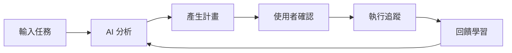

# Mind Planet 心智行星 - 概念設計

## 核心理念
「讓 AI 成為你的個人軍師，協助規劃每一天」

## 功能設計

### 1. 每日規劃助手
```typescript
// 使用者輸入
interface DailyInput {
  tasks: string[]           // ["開會", "寫報告", "運動"]
  availableTime: TimeSlot[] // 可用時段
  energy: 'high' | 'medium' | 'low'
  deadline?: Task[]         // 有期限的任務
}

// AI 輸出
interface DailyPlan {
  optimizedSchedule: ScheduleItem[]
  suggestions: string[]      // 建議事項
  resources: Resource[]      // 相關資源連結
  alternatives: Plan[]       // 備選方案
}
```

### 2. 智慧排序邏輯

**考量因素**：
- **緊急度**：期限接近的優先
- **重要性**：影響大的優先
- **能量匹配**：高能量時做困難任務
- **相依性**：A 必須在 B 之前完成
- **時間區塊**：相似任務集中處理

### 3. AI 建議範例

```
使用者輸入：
- 寫季度報告
- 回覆 10 封郵件
- 運動 30 分鐘
- 準備明天簡報
- 買菜

AI 建議：
1. 09:00-10:30 準備明天簡報（高能量，最緊急）
2. 10:30-11:00 回覆郵件（批次處理）
3. 11:00-12:30 寫季度報告（需要專注）
4. 12:30-13:30 午餐 + 買菜（結合外出）
5. 16:00-16:30 運動（下午能量低點）

💡 建議：
- 簡報可參考上季模板（連結）
- 報告建議分 3 個番茄鐘完成
- 17:00 後避免高強度工作
```

## 技術架構

### 前端介面
```typescript
// apps/web/src/pages/MindPlanet.tsx
function MindPlanet() {
  return (
    <div>
      <TaskInput />           {/* 輸入今日任務 */}
      <AIPlanner />          {/* AI 規劃結果 */}
      <ResourcePanel />      {/* 相關資源 */}
      <ExecutionTracker />   {/* 執行追蹤 */}
    </div>
  )
}
```

### 後端服務
```typescript
// apps/api/src/services/ai-planner.ts
class AIPlannerService {
  async generatePlan(input: DailyInput) {
    // 1. 分析任務屬性
    const analyzedTasks = await this.analyzeTasks(input.tasks)

    // 2. 調用 AI API
    const aiResponse = await this.callAI(analyzedTasks)

    // 3. 優化排程
    const optimized = this.optimizeSchedule(aiResponse)

    // 4. 產生資源連結
    const resources = await this.findResources(tasks)

    return { optimized, resources }
  }
}
```

### AI 整合選項

1. **OpenAI GPT-4**
   - 優點：最強大，理解力佳
   - 缺點：成本較高

2. **Claude API**
   - 優點：擅長分析和規劃
   - 缺點：需要 API key

3. **Local LLM (Ollama)**
   - 優點：免費，隱私
   - 缺點：需要本地運算資源

4. **混合方案**
   - 簡單排序：本地演算法
   - 複雜建議：調用 API

## 資料模型

```prisma
// prisma/schema.prisma
model MindPlanetSession {
  id          String   @id @default(cuid())
  userId      String
  date        DateTime
  input       Json     // 原始輸入
  plan        Json     // AI 產生的計畫
  feedback    String?  // 使用者回饋
  executed    Boolean  @default(false)
  createdAt   DateTime @default(now())

  user        User     @relation(fields: [userId], references: [id])
}

model TaskTemplate {
  id          String   @id @default(cuid())
  name        String
  category    String
  duration    Int      // 預估時間（分鐘）
  energy      String   // 需要的能量等級
  resources   Json?    // 相關資源
}
```

## 使用流程



## MVP 功能（第一版）

1. **基本排序**
   - 依據時間和優先級排序
   - 不需要 AI，用演算法即可

2. **時間分配**
   - 自動分配時間區塊
   - 考慮休息時間

3. **簡單建議**
   - 預設的建議模板
   - 基於時間的提醒

## 進階功能（未來）

1. **學習使用者習慣**
   - 記錄完成時間
   - 調整預估準確度

2. **整合其他模組**
   - 從時程管理拉取既有行程
   - 考慮健康數據（睡眠品質）
   - 財務限制（預算考量）

3. **協作功能**
   - 團隊任務協調
   - 會議時間建議

## 隱私考量

- 敏感資料本地處理
- 可選擇是否使用雲端 AI
- 資料加密儲存
- 使用者可刪除所有資料

---

## 為什麼叫 Mind Planet？

就像行星有自己的軌道，Mind Planet 幫助你的思緒和任務找到最佳軌道，在 Orbit 系統中和諧運轉。